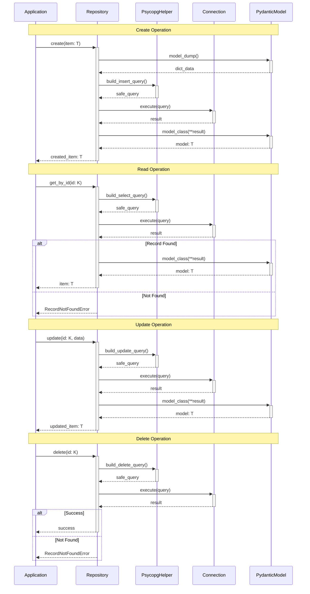

# BaseRepository Documentation

The `BaseRepository` implements the repository pattern, providing a type-safe, generic interface for database operations. It abstracts away SQL complexity while ensuring secure database interactions through `PsycopgHelper`.

## Understanding the Design

The repository uses generics to ensure type safety for both models and primary keys:

```python
from uuid import UUID
from pydantic import BaseModel
from psycopg_toolkit import BaseRepository

# Define your data model with Pydantic
class User(BaseModel):
    id: UUID  # Or any other primary key type (int, str, etc.)
    username: str
    email: str

# Create a typed repository specifying model and primary key type
class UserRepository(BaseRepository[User, UUID]):  # Or [User, int] for integer primary keys
    def __init__(self, db_connection):
        super().__init__(
            db_connection=db_connection,
            table_name="users",
            model_class=User,  # Type information for validation
            primary_key="id"   # Primary key for lookups
        )
```

The generic type parameters ensure that:
- Only User objects can be created through this repository
- All queries return properly typed User objects
- Type checking catches mismatched models at compile time
- Primary key operations use the correct type (UUID, int, etc.)
- Primary key type safety is enforced at compile time

## CRUD Operations Explained

### Create: Understanding Data Flow

```python
# Single record creation
async def create_user():
    # Create Pydantic model instance - validates data
    user_data = User(
        id=uuid4(),  # Or any valid primary key type
        username="john_doe",
        email="john@example.com"
    )
    
    # Repository handles:
    # 1. Converts Pydantic model to dict
    # 2. Constructs safe SQL via PsycopgHelper
    # 3. Executes query with parameters
    # 4. Converts result back to Pydantic model
    user = await repository.create(user_data)
```

Under the hood:
```python
# The repository converts your model to a secure query:
insert_query = PsycopgHelper.build_insert_query(self.table_name, data)
# Generates: INSERT INTO users (id, username, email) VALUES ($1, $2, $3)
# RETURNING ensures we get back the created record
await cur.execute(insert_query + SQL(" RETURNING *"), list(data.values()))
```

For bulk operations:
```python
async def create_many_users():
    # Create multiple users efficiently
    users = [
        User(id=uuid4(), username=f"user_{i}", email=f"user_{i}@example.com")
        for i in range(3)
    ]
    
    # Repository handles:
    # 1. Batches records for efficient insertion
    # 2. Maintains transaction safety
    # 3. Returns all created records
    created_users = await repository.create_bulk(users, batch_size=100)
```

### Read: Safe Query Construction

```python
# Get by ID - Type-safe primary key lookup
async def get_user(user_id: UUID):  # Or user_id: int for integer primary keys
    # Repository handles:
    # 1. Constructs safe parameterized query
    # 2. Executes with proper parameter binding
    # 3. Raises RecordNotFoundError if not found
    # 4. Converts result to Pydantic model
    user = await repository.get_by_id(user_id)

# Get all records - Efficient bulk loading
async def list_users():
    # Repository handles:
    # 1. Constructs optimized SELECT query
    # 2. Converts all results to Pydantic models
    users = await repository.get_all()
```

The underlying query construction:
```python
# Safe query building with PsycopgHelper
select_query = PsycopgHelper.build_select_query(
    self.table_name,
    where_clause={self.primary_key: record_id}
)
# Generates: SELECT * FROM users WHERE id = $1
# Parameters are always bound separately for security
await cur.execute(select_query, [record_id])
```

### Update: Safe Data Modifications

```python
# Type-safe updates using the correct primary key type
async def update_user(user_id: UUID):  # Or user_id: int for integer primary keys
    # Specify only fields that need updating
    updates = {
        "username": "new_username",
        "email": "new@example.com"
    }
    
    # Repository handles:
    # 1. Validates record exists
    # 2. Constructs safe UPDATE query
    # 3. Returns updated Pydantic model
    updated_user = await repository.update(user_id, updates)
```

Security and validation:
```python
# The repository ensures safe updates
update_query = PsycopgHelper.build_update_query(
    self.table_name,
    data,
    where_clause={self.primary_key: record_id}
)
# Generates: UPDATE users SET username = $1, email = $2 WHERE id = $3
# Returns full record: RETURNING *
await cur.execute(update_query + SQL(" RETURNING *"), 
                 list(data.values()) + [record_id])
```

### Delete: Safe Record Removal

```python
async def remove_user(user_id: UUID):  # Or user_id: int for integer primary keys
    # Repository handles:
    # 1. Verifies record exists
    # 2. Constructs safe DELETE query
    # 3. Raises error if record not found
    await repository.delete(user_id)
```

Delete operation internals:
```python
# Safe delete construction
delete_query = PsycopgHelper.build_delete_query(
    self.table_name,
    where_clause={self.primary_key: record_id}
)
# Generates: DELETE FROM users WHERE id = $1
await cur.execute(delete_query, [record_id])
```

## Error Handling and Safety

The repository provides specific exceptions for different scenarios:

```python
try:
    user = await repository.get_by_id(user_id)
except RecordNotFoundError:
    # Record doesn't exist - handle missing data
    logger.warning(f"User {user_id} not found")
except OperationError as e:
    # Database operation failed - handle error
    logger.error(f"Database error: {e}")
    # Contains original exception in .original_error
```

## Practical Usage Patterns

### Transaction Management

```python
# Using with transaction manager ensures:
# 1. All operations succeed or all rollback
# 2. Connection is properly managed
# 3. Errors trigger automatic rollback
async with tm.transaction() as conn:
    repo = UserRepository(conn)
    
    # Create and update in same transaction
    user = await repo.create(User(
        id=uuid4(),  # Or any valid primary key
        username="john",
        email="john@example.com"
    ))
    
    # This only commits if both operations succeed
    await repo.update(user.id, {"username": "john_doe"})
```

### Connection Management

```python
# Using with database connection:
# 1. Automatically manages connection lifecycle
# 2. Returns connection to pool when done
# 3. Handles errors properly
async with db.connection() as conn:
    repo = UserRepository(conn)
    users = await repo.get_all()
```

## Advanced Usage

### Custom Queries

While the base repository provides common operations, you can extend it for custom needs:

```python
class UserRepository(BaseRepository[User, UUID]):  # Specify model and primary key type
    async def find_by_email(self, email: str) -> Optional[User]:
        query = PsycopgHelper.build_select_query(
            self.table_name,
            where_clause={"email": email}
        )
        
        async with self.db_connection.cursor() as cur:
            await cur.execute(query, [email])
            result = await cur.fetchone()
            return User(**result) if result else None
```

### Batch Operations

For efficient bulk operations:

```python
async def create_users_batch(users: List[User]):
    # Efficient bulk insert with customizable batch size
    # Larger batch sizes can improve performance but use more memory
    created = await repository.create_bulk(users, batch_size=100)
    
    # All records created in single transaction
    # Returns list of created User objects
    return created
```

## Architecture

### Repository Pattern Sequence Diagram



## JSONB Support

The BaseRepository provides comprehensive support for PostgreSQL's JSONB data type with automatic field detection and seamless serialization/deserialization.

### Automatic JSON Field Detection

JSON fields are automatically detected from Pydantic type hints:

```python
from typing import Dict, List, Optional, Any
from pydantic import BaseModel
from psycopg_toolkit import BaseRepository

class UserProfile(BaseModel):
    id: int
    username: str
    email: str
    
    # These fields are automatically detected as JSONB
    metadata: Dict[str, Any]              # Dictionary -> JSONB
    preferences: Dict[str, str]           # String dictionary -> JSONB  
    tags: List[str]                       # List -> JSONB
    profile_data: Optional[Dict[str, Any]] = None  # Optional dict -> JSONB

class UserRepository(BaseRepository[UserProfile, int]):
    def __init__(self, db_connection):
        super().__init__(
            db_connection=db_connection,
            table_name="user_profiles",
            model_class=UserProfile,
            primary_key="id"
            # auto_detect_json=True by default
        )
```

### JSONB Operations Example

```python
async def jsonb_example():
    async with db.connection() as conn:
        repo = UserRepository(conn)
        
        # Create user with complex JSON data
        user = UserProfile(
            id=1,
            username="john_doe",
            email="john@example.com",
            metadata={
                "created_at": "2024-01-01T10:00:00",
                "source": "web_registration",
                "browser": {
                    "name": "Chrome",
                    "version": "120.0",
                    "os": "macOS"
                },
                "location": {
                    "country": "US",
                    "timezone": "EST"
                }
            },
            preferences={
                "theme": "dark",
                "language": "en",
                "notifications": "email"
            },
            tags=["premium", "early_adopter", "newsletter"],
            profile_data={
                "bio": "Software engineer passionate about databases",
                "skills": ["Python", "PostgreSQL", "Docker"],
                "experience_years": 5
            }
        )
        
        # JSON fields automatically serialized to JSONB
        created_user = await repo.create(user)
        print(f"Created user: {created_user.username}")
        
        # JSON fields automatically deserialized from JSONB
        retrieved_user = await repo.get_by_id(1)
        print(f"Browser: {retrieved_user.metadata['browser']['name']}")
        print(f"Theme: {retrieved_user.preferences['theme']}")
        print(f"Skills: {retrieved_user.profile_data['skills']}")
        
        # Update JSON fields
        updated_user = await repo.update(1, {
            "preferences": {
                **retrieved_user.preferences,
                "theme": "light",
                "new_feature_beta": "true"
            },
            "tags": retrieved_user.tags + ["updated"]
        })
        
        print(f"Updated theme: {updated_user.preferences['theme']}")
        print(f"Updated tags: {updated_user.tags}")
```

### Manual JSON Field Configuration

For precise control over which fields are treated as JSON:

```python
class ProductRepository(BaseRepository[Product, int]):
    def __init__(self, db_connection):
        super().__init__(
            db_connection=db_connection,
            table_name="products", 
            model_class=Product,
            primary_key="id",
            # Explicitly specify JSON fields
            json_fields={"specifications", "categories"},
            # Disable automatic detection
            auto_detect_json=False
        )
```

### psycopg JSON Adapters (Recommended)

For optimal performance, use psycopg's native JSON adapters:

```python
# Database configuration with JSON adapters enabled
settings = DatabaseSettings(
    host="localhost",
    port=5432,
    dbname="mydb",
    user="user", 
    password="password",
    enable_json_adapters=True  # Enable psycopg JSON adapters
)

# Repository configuration - disable custom JSON processing
class UserRepository(BaseRepository[UserProfile, int]):
    def __init__(self, db_connection):
        super().__init__(
            db_connection=db_connection,
            table_name="user_profiles",
            model_class=UserProfile,
            primary_key="id",
            # Let psycopg handle JSON automatically
            auto_detect_json=False
        )
```

### JSONB Error Handling

Handle JSON-specific errors with dedicated exceptions:

```python
from psycopg_toolkit import (
    JSONProcessingError,
    JSONSerializationError,
    JSONDeserializationError
)

# Enable strict JSON processing for detailed error reporting
class StrictRepository(BaseRepository[UserProfile, int]):
    def __init__(self, db_connection):
        super().__init__(
            db_connection=db_connection,
            table_name="user_profiles",
            model_class=UserProfile,
            primary_key="id",
            strict_json_processing=True  # Raise exceptions on JSON errors
        )

# Usage with error handling
try:
    user = await repo.create(user_data)
except JSONSerializationError as e:
    print(f"JSON serialization failed: {e}")
    print(f"Field: {e.field_name}")
    print(f"Original error: {e.original_error}")
except JSONDeserializationError as e:
    print(f"JSON deserialization failed: {e}")
    print(f"Field: {e.field_name}")
    print(f"Invalid data: {e.json_data}")
```

### Database Schema for JSONB

Create tables with JSONB columns and appropriate indexes:

```sql
-- Create table with JSONB columns
CREATE TABLE user_profiles (
    id SERIAL PRIMARY KEY,
    username VARCHAR(100) NOT NULL UNIQUE,
    email VARCHAR(255) NOT NULL,
    
    -- JSONB columns
    metadata JSONB NOT NULL DEFAULT '{}',
    preferences JSONB NOT NULL DEFAULT '{}', 
    tags JSONB NOT NULL DEFAULT '[]',
    profile_data JSONB
);

-- Create GIN indexes for efficient JSONB queries
CREATE INDEX idx_user_metadata ON user_profiles USING GIN (metadata);
CREATE INDEX idx_user_preferences ON user_profiles USING GIN (preferences); 
CREATE INDEX idx_user_tags ON user_profiles USING GIN (tags);

-- Create functional indexes for specific queries
CREATE INDEX idx_user_theme ON user_profiles 
USING BTREE ((preferences->>'theme'));
```

### JSONB Querying

Query JSONB data using PostgreSQL's rich JSONB operators:

```python
async def jsonb_queries():
    async with db.connection() as conn:
        async with conn.cursor() as cur:
            
            # Find users by browser type
            await cur.execute("""
                SELECT username, metadata->'browser'->>'name' as browser
                FROM user_profiles
                WHERE metadata->'browser'->>'name' = %s
            """, ["Chrome"])
            
            # Find users with specific preference
            await cur.execute("""
                SELECT username, preferences->>'theme' as theme
                FROM user_profiles  
                WHERE preferences->>'theme' = %s
            """, ["dark"])
            
            # Find users with specific tags
            await cur.execute("""
                SELECT username, tags
                FROM user_profiles
                WHERE tags ? %s
            """, ["premium"])
            
            # Complex JSON queries
            await cur.execute("""
                SELECT username, metadata
                FROM user_profiles
                WHERE metadata @> %s
                  AND jsonb_array_length(tags) > %s
            """, ['{"source": "web_registration"}', 2])
```

For comprehensive JSONB documentation, see [JSONB Support](jsonb_support.md).