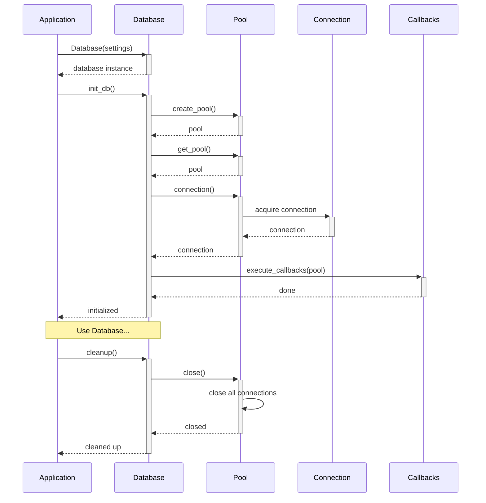
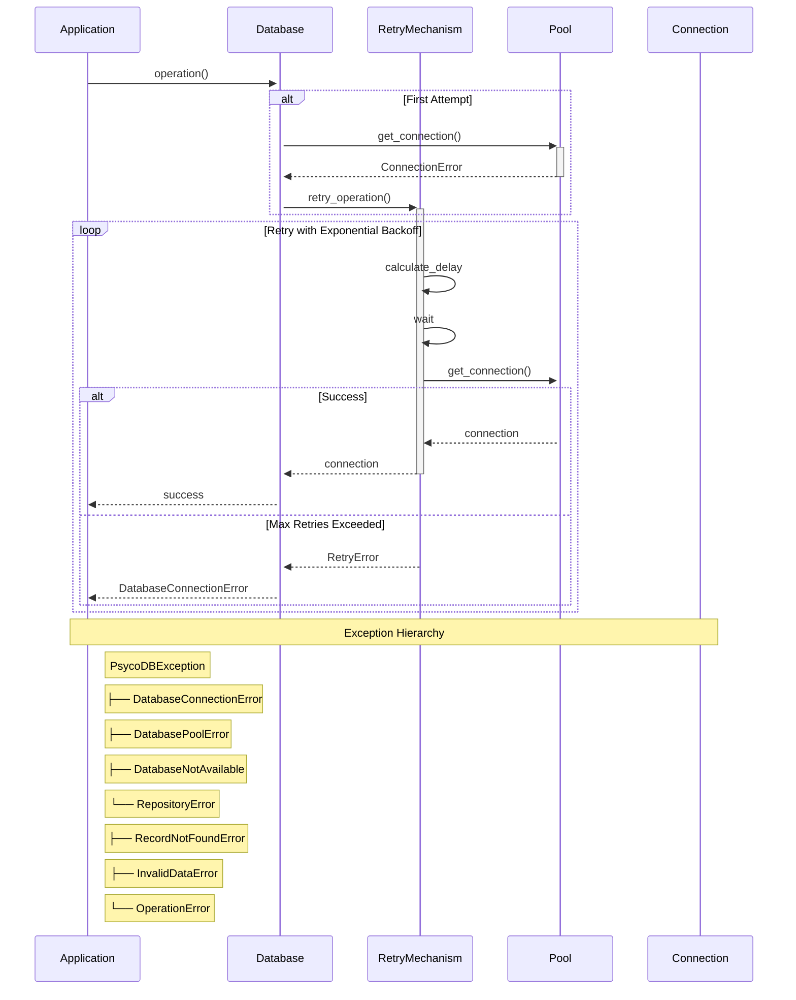
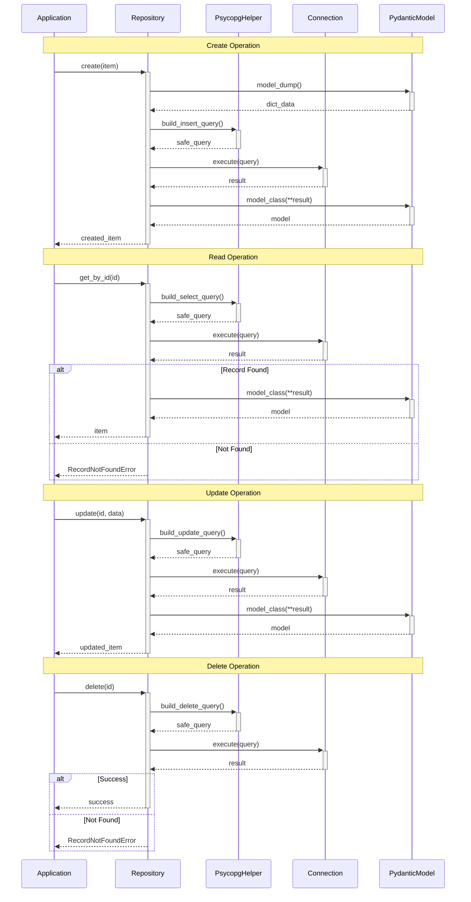
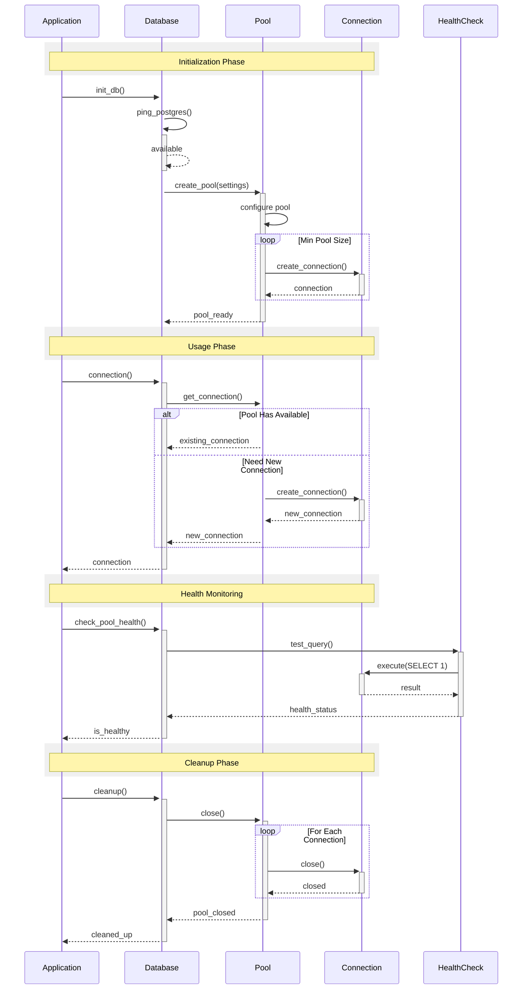

# Database Management

The `Database` class is the core component of psycopg-toolkit that manages PostgreSQL database connections using psycopg3. It provides connection pooling, transaction management, health checks, and a robust interface for database operations.

## Quick Start

```python
from psycopg_toolkit import Database, DatabaseSettings

# Configure settings
settings = DatabaseSettings(
    host="localhost",
    port=5432,
    dbname="mydb",
    user="myuser",
    password="mypassword"
)

# Initialize database with connection pool
db = Database(settings)
await db.init_db()

# Use the database
async with db.connection() as conn:
    async with conn.cursor() as cur:
        await cur.execute("SELECT * FROM mytable")
        results = await cur.fetchall()

# Cleanup when done
await db.cleanup()
```

## Configuration

### Database Settings

The `DatabaseSettings` class handles database configuration:

```python
settings = DatabaseSettings(
    # Required settings
    host="localhost",        # Database host
    port=5432,              # Database port
    dbname="mydb",          # Database name
    user="myuser",          # Database user
    password="mypassword",  # Database password
    
    # Optional settings
    min_pool_size=5,        # Minimum connections (default: 5)
    max_pool_size=20,       # Maximum connections (default: 20)  
    pool_timeout=30,        # Connection timeout in seconds (default: 30)
    connection_timeout=5.0,  # Initial connection timeout (default: 5.0)
    statement_timeout=None,  # SQL statement timeout (default: None)
    enable_json_adapters=True  # Enable psycopg JSON adapters for JSONB (default: True)
)
```

## Core Features

### Connection Management

The Database class provides several ways to manage connections:

```python
# Context manager for automatic connection handling
async with db.connection() as conn:
    async with conn.cursor() as cur:
        await cur.execute("SELECT 1")

# Transaction context manager
async with db.transaction() as conn:
    async with conn.cursor() as cur:
        await cur.execute("INSERT INTO users (name) VALUES (%s)", ["Alice"])

# Get transaction manager for advanced transaction control
tm = await db.get_transaction_manager()
async with tm.transaction() as conn:
    # Transaction operations
    pass
```

### Connection Pool Features

The connection pool provides:

- Automatic connection acquisition and release
- Connection validation
- Pool size management
- Connection timeouts
- Automatic retry with exponential backoff

### Health Monitoring

```python
# Check database connectivity
is_available = db.ping_postgres()

# Check pool health
is_healthy = await db.check_pool_health()

# Get pool status
is_active = db.is_pool_active()
```

### Initialization Callbacks

Register functions to run after pool initialization:

```python
async def init_schema(pool):
    async with pool.connection() as conn:
        async with conn.cursor() as cur:
            await cur.execute("""
                CREATE TABLE IF NOT EXISTS users (
                    id SERIAL PRIMARY KEY,
                    name TEXT NOT NULL
                )
            """)

# Register callback
await db.register_init_callback(init_schema)
```

## Error Handling

The Database class provides specific exceptions:

```python
try:
    async with db.connection() as conn:
        # Database operations
        pass
except DatabaseConnectionError as e:
    print(f"Connection error: {e}")
    print(f"Original error: {e.original_error}")
except DatabasePoolError as e:
    print(f"Pool error: {e}")
except DatabaseNotAvailable as e:
    print(f"Database not available: {e}")
```

## Best Practices

### Resource Management

1. Always use async context managers:
```python
# Good
async with db.connection() as conn:
    # Operations
    pass

# Bad - Manual connection handling
conn = await pool.getconn()
try:
    # Operations
    pass
finally:
    await pool.putconn(conn)
```

2. Clean up resources:
```python
try:
    await db.init_db()
    # Application code
finally:
    await db.cleanup()
```

### Pool Configuration

1. Set appropriate pool sizes:
```python
settings = DatabaseSettings(
    # ... connection settings ...
    min_pool_size=5,     # Base on minimum load
    max_pool_size=20,    # Base on maximum load
    pool_timeout=30      # Adjust for operation timing
)
```

2. Monitor pool health:
```python
if not await db.check_pool_health():
    # Handle unhealthy pool
    await notify_admin("Database pool requires attention")
```

### Error Recovery

1. Use built-in retry mechanism:
```python
# Database.ping_postgres() automatically retries with exponential backoff
is_available = db.ping_postgres()
```

2. Handle cleanup properly:
```python
try:
    await db.init_db()
    # Database operations
except Exception:
    # Handle errors
finally:
    await db.cleanup()
```

## Advanced Usage

### Connection Pool Management

```python
# Create pool with custom settings
settings = DatabaseSettings(
    # ... basic settings ...
    min_pool_size=10,
    max_pool_size=50,
    pool_timeout=60,
    connection_timeout=10.0,
    statement_timeout=30.0
)

# Initialize pool
db = Database(settings)
await db.create_pool()
```

### Statement Timeout Configuration

```python
settings = DatabaseSettings(
    # ... other settings ...
    statement_timeout=30.0  # 30 second timeout for queries
)

db = Database(settings)
await db.init_db()

async with db.connection() as conn:
    # All queries in this connection have 30s timeout
    async with conn.cursor() as cur:
        await cur.execute("SELECT * FROM large_table")
```

### Multiple Database Support

```python
# Create separate database instances
db_primary = Database(settings_primary)
db_replica = Database(settings_replica)

# Initialize both
await db_primary.init_db()
await db_replica.init_db()

try:
    # Use appropriate database based on operation
    async with db_primary.connection() as conn:
        # Write operations
        pass
    
    async with db_replica.connection() as conn:
        # Read operations
        pass
finally:
    # Cleanup both
    await db_primary.cleanup()
    await db_replica.cleanup()
```

## Architecture

### Database lifecycle Sequence diagram



### Error handling flow



### Schema management lifecycle



### Pool Lifecycle Sequence diagram


