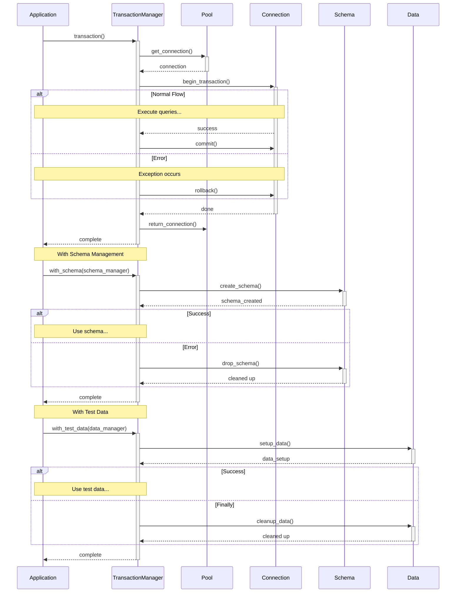

# Transaction Management

The `TransactionManager` provides transaction control, schema management, and test data handling for PostgreSQL databases through psycopg3.

## Quick Start

```python
from psycopg_toolkit import Database, DatabaseSettings

# Initialize database
db = Database(settings)
await db.init_db()

# Get transaction manager
tm = await db.get_transaction_manager()

# Use in transaction
async with tm.transaction() as conn:
    async with conn.cursor() as cur:
        await cur.execute("INSERT INTO users (id, name) VALUES (%s, %s)", 
                         (user_id, name))
```

## Core Features

### Basic Transactions

```python
# Simple transaction
async with tm.transaction() as conn:
    async with conn.cursor() as cur:
        await cur.execute("INSERT INTO users (id, name) VALUES (%s, %s)", 
                         (user_id, name))

# With savepoint
async with tm.transaction(savepoint="user_creation") as conn:
    async with conn.cursor() as cur:
        await cur.execute("INSERT INTO users (id, name) VALUES (%s, %s)", 
                         (user_id, name))
```

### Schema Management

Implement `SchemaManager` for database schema operations:

```python
class UserSchemaManager(SchemaManager[None]):
    async def create_schema(self, conn: AsyncConnection) -> None:
        await conn.execute("""
            CREATE TABLE IF NOT EXISTS users (
                id UUID PRIMARY KEY,
                email TEXT UNIQUE NOT NULL,
                created_at TIMESTAMP WITH TIME ZONE DEFAULT NOW()
            );
        """)

    async def drop_schema(self, conn: AsyncConnection) -> None:
        await conn.execute("DROP TABLE IF EXISTS users;")

# Use with transaction manager
async with tm.with_schema(UserSchemaManager()) as schema:
    # Schema is created, operations here
    pass  # Schema automatically dropped if exception occurs
```

### Test Data Management

Implement `DataManager` for test data handling:

```python
class TestUserData(DataManager[dict]):
    def __init__(self, test_users: list[dict]):
        self.test_users = test_users

    async def setup_data(self, conn: AsyncConnection) -> dict:
        async with conn.cursor() as cur:
            for user in self.test_users:
                await cur.execute(
                    "INSERT INTO users (id, email) VALUES (%s, %s)",
                    (user['id'], user['email'])
                )
        return {"users": self.test_users}

    async def cleanup_data(self, conn: AsyncConnection) -> None:
        await conn.execute("DELETE FROM users;")

# Use with transaction manager
async with tm.with_test_data(TestUserData(test_users)) as data:
    # Test data is inserted, perform tests
    pass  # Data automatically cleaned up
```

### Combined Operations

Use `managed_transaction` for schema and data operations:

```python
async with tm.managed_transaction(
    schema_manager=UserSchemaManager(),
    data_manager=TestUserData(test_users)
) as conn:
    # Schema created and test data inserted
    # Perform operations
    pass  # Everything cleaned up automatically
```

## Error Handling

The transaction manager provides automatic rollback:

```python
try:
    async with tm.transaction() as conn:
        async with conn.cursor() as cur:
            await cur.execute("INSERT INTO users (id, name) VALUES (%s, %s)", 
                            (user_id, name))
except DatabaseConnectionError as e:
    # Connection error handling
    print(f"Connection failed: {e.original_error}")
except DatabaseNotAvailable as e:
    # Database unavailable
    print(f"Database not available: {e}")
except DatabasePoolError as e:
    # Pool error
    print(f"Pool error: {e}")
```

## Best Practices

### Transaction Scope

1. Keep transactions focused:
```python
# Good: Short, focused transaction
async with tm.transaction() as conn:
    await create_user(conn, user_data)

# Bad: Long-running transaction
async with tm.transaction() as conn:
    await process_many_records(conn)  # Long operation
    await external_api_call()  # Network I/O
```

2. Use savepoints for nested operations:
```python
async with tm.transaction(savepoint="outer") as conn:
    # Outer transaction
    async with tm.transaction(savepoint="inner") as _:
        # Inner transaction with savepoint
        pass
```

### Schema Management

1. Implement clear cleanup:
```python
class MySchemaManager(SchemaManager[None]):
    async def drop_schema(self, conn: AsyncConnection) -> None:
        # Always clean up in reverse order of creation
        await conn.execute("DROP TABLE IF EXISTS child;")
        await conn.execute("DROP TABLE IF EXISTS parent;")
```

2. Handle schema dependencies:
```python
async def create_schema(self, conn: AsyncConnection) -> None:
    # Create tables in dependency order
    await conn.execute("CREATE TABLE parent (...);")
    await conn.execute("""
        CREATE TABLE child (
            parent_id UUID REFERENCES parent(id)
        );
    """)
```

### Test Data Management

1. Clean data thoroughly:
```python
async def cleanup_data(self, conn: AsyncConnection) -> None:
    # Clean in reverse dependency order
    await conn.execute("DELETE FROM child;")
    await conn.execute("DELETE FROM parent;")
```

2. Handle test data dependencies:
```python
async def setup_data(self, conn: AsyncConnection) -> dict:
    # Insert in dependency order
    parent_ids = await self.insert_parents(conn)
    child_ids = await self.insert_children(conn, parent_ids)
    return {"parents": parent_ids, "children": child_ids}
```

## Advanced Usage

### Custom Schema Types

```python
# Schema manager with configuration
class ConfigurableSchema(SchemaManager[dict]):
    async def create_schema(self, conn: AsyncConnection) -> dict:
        config = await self.load_config()
        await self.create_tables(conn, config)
        return config

# Usage
async with tm.with_schema(ConfigurableSchema()) as config:
    # Use schema configuration
    pass
```

### Complex Data Scenarios

```python
# Composite data manager
class TestEnvironment(DataManager[dict]):
    def __init__(self, user_data: TestUserData, 
                 product_data: TestProductData):
        self.user_data = user_data
        self.product_data = product_data

    async def setup_data(self, conn: AsyncConnection) -> dict:
        user_result = await self.user_data.setup_data(conn)
        product_result = await self.product_data.setup_data(conn)
        return {
            "users": user_result,
            "products": product_result
        }

    async def cleanup_data(self, conn: AsyncConnection) -> None:
        await self.product_data.cleanup_data(conn)
        await self.user_data.cleanup_data(conn)
```

### Integration with Repositories

```python
from psycopg_toolkit import BaseRepository

class UserRepository(BaseRepository[User]):
    def __init__(self, conn: AsyncConnection):
        super().__init__(conn, "users", User)

async with tm.transaction() as conn:
    repo = UserRepository(conn)
    # Repository operations within transaction
    users = await repo.get_all()
```


## Architecture

### TransactionManager Sequence diagram

